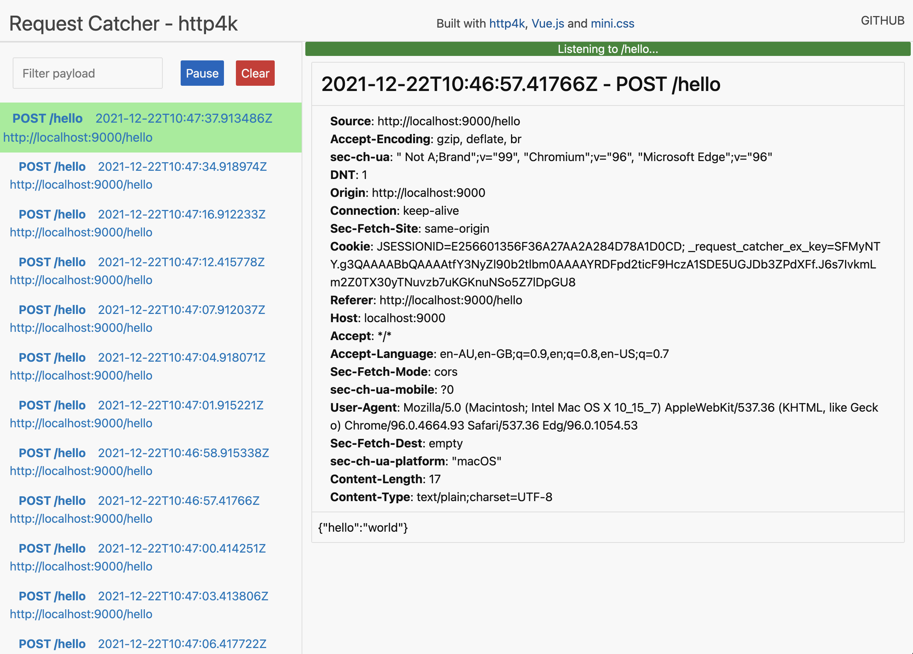

# RequestCatcher

## How it works
- Uses [http4k](https://http4k.org) as a server
- Uses [Vue.js](https://v3.vuejs.org) to augment the frontend
- Uses Websockets to broadcast requests received
- Uses [mini.css](https://minicss.org/) as a lightweight framework



### Running via Docker
```
./gradlew build testZip
docker compose up --build
```

### Example

Visit [http://localhost:9000/hello](http://localhost:9000/hello)

To test from the command line:
```shell
curl -X PUT -d '{"json":"body"}' http://localhost:9000/hello
curl -X PUT -d 'Hello World!' http://localhost:9000/hello
```
or in the browser Javascript console
```javascript
setInterval(() => {
    fetch("/hello", {method: "POST", body: JSON.stringify({hello: "world"})})
}, 1500)
```
